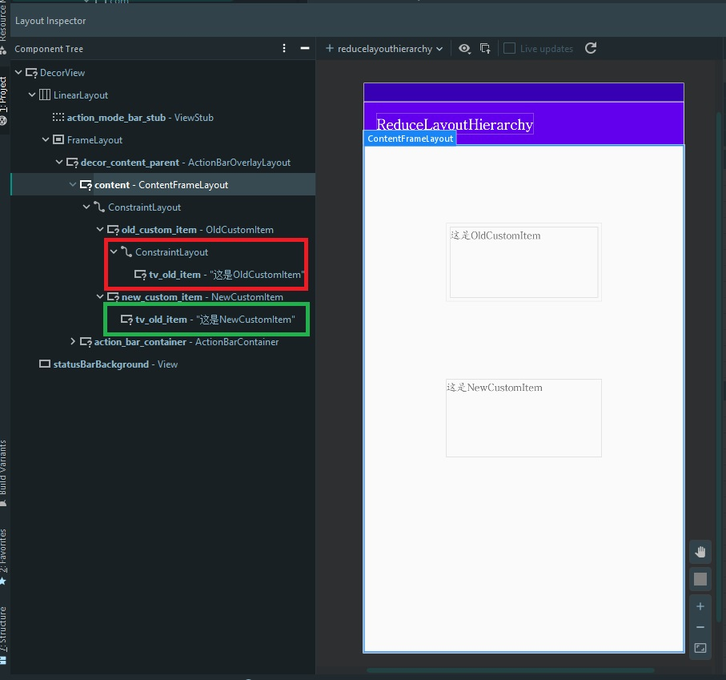

# ReduceLayoutHierarchy
### 一种减少自定义View层级方法

##### 1

在自定义 View 中，如果是复杂一些的布局，那么有时候会选择继承于某一个控件，然后在构造方法中 inflate 一个预先设计好的xml布局文件。

```kotlin
class OldCustomItem: ConstraintLayout {
    private var titleTextView: TextView? = null
    ......
    private fun initCustomView() {
        LayoutInflater.from(context).inflate(R.layout.layout_old_custom_item, this)
        titleTextView = findViewById(R.id.tv_old_item)
        titleTextView?.text = "这是OldCustomItem"
    }
}
```

其中**layout_old_custom_item.xml**

```xml
<?xml version="1.0" encoding="utf-8"?>
<androidx.constraintlayout.widget.ConstraintLayout
    xmlns:android="http://schemas.android.com/apk/res/android"
    android:layout_width="match_parent"
    android:layout_height="match_parent"
    xmlns:app="http://schemas.android.com/apk/res-auto"
    android:layout_margin="5dp">

    <TextView
        android:id="@+id/tv_old_item"
        android:layout_width="0dp"
        android:layout_height="0dp"
        app:layout_constraintStart_toStartOf="parent"
        app:layout_constraintEnd_toEndOf="parent"
        app:layout_constraintTop_toTopOf="parent"
        app:layout_constraintBottom_toBottomOf="parent">
    </TextView>

</androidx.constraintlayout.widget.ConstraintLayout>
```

然而，这样做的话，其实会导致让这个CustomItem凭白多了一层无用的外层ConstraintLayout布局。


##### 2

针对这种莫名其妙多一层无用布局的问题，我们可以在充分利用自定义xml的情况下，做一些改变。

```kotlin
class NewCustomItem: ConstraintLayout {
    private var titleTextView: TextView? = null
    ......
    private fun applyLayoutFromXml() {
        val view = View.inflate(context, R.layout.layout_old_custom_item, null)
        if (view is ConstraintLayout) {
            val titleView = view.findViewById<TextView>(R.id.tv_old_item)

            view.removeView(titleView)
            this.addView(titleView)
            this.titleTextView = titleView
            this.titleTextView?.text = "这是NewCustomItem"
        }
    }
}
```

同样是需要对布局文件 layout_old_custom_item.xml 进行 inflate，但是这样操作，可以让之前多余的那层布局消失掉。


对比图：


